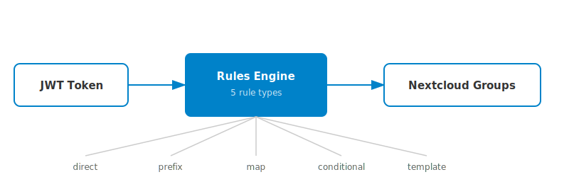
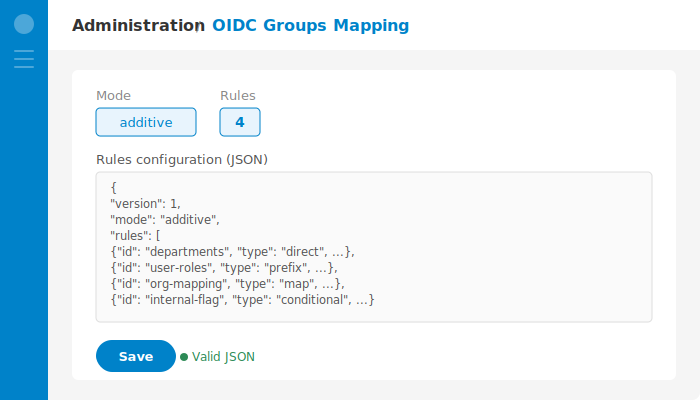

<!--
  - SPDX-FileCopyrightText: 2026 OIDC Groups Mapping Contributors
  - SPDX-License-Identifier: AGPL-3.0-or-later
-->

# OIDC Groups Mapping

[](https://github.com/strobelpierre/nextcloud_oidc_groups_mapping/actions/workflows/phpunit.yml)
[](https://github.com/strobelpierre/nextcloud_oidc_groups_mapping/actions/workflows/lint.yml)
[](https://github.com/strobelpierre/nextcloud_oidc_groups_mapping/actions/workflows/psalm.yml)
[](https://github.com/strobelpierre/nextcloud_oidc_groups_mapping/actions/workflows/reuse.yml)
[](https://github.com/strobelpierre/nextcloud_oidc_groups_mapping/releases/latest)
[](https://www.gnu.org/licenses/agpl-3.0)


[](https://github.com/strobelpierre/nextcloud_oidc_groups_mapping)

A Nextcloud app that maps **multiple** OIDC token claims to Nextcloud groups via configurable rules. Works with any identity provider through the [user_oidc](https://github.com/nextcloud/user_oidc) app.



## Features

- **Vue admin UI** — visual rule editor with 3 tabs (Visual Editor, JSON, Simulator)
- **Drag-and-drop reorder** — reorder rules visually in the admin panel
- **5 rule types** — direct, prefix, map, conditional, template
- **Dot-notation claim paths** — access any nested token field
- **Additive or replace mode** — merge with or override existing groups
- **REST API** — manage rules programmatically via OCS endpoints
- **OCC commands** — list, set, and test rules from the CLI
- **Dark mode** — full support for Nextcloud dark and light themes
- **Zero config on user_oidc** — works with any provider setup

## Table of contents

- [The problem](#the-problem)
- [Quick start](#quick-start)
- [Rule types](#rule-types)
- [Configuration](#configuration)
- [Configuring user_oidc](#configuring-user_oidc)
- [Admin settings](#admin-settings)
- [REST API](#rest-api)
- [OCC commands](#occ-commands)
- [How it works](#how-it-works)
- [Installation](#installation)
- [Development](#development)
- [Troubleshooting](#troubleshooting)
- [Contributing](#contributing)

## The problem

Your identity provider sends a JWT token like this:

```json
{
  "sub": "jdoe",
  "email": "jdoe@example.com",
  "department": "Engineering",
  "roles": ["admin", "editor"],
  "organization": "corp.example.com",
  "userType": "INTERNAL"
}
```

With `user_oidc` alone, you can map **one** claim to groups (`mappingGroups`). But what if you need groups from `department`, `roles`, `organization`, and `userType` all at once?

**This app solves that.** Configure rules to map any number of claims to Nextcloud groups:

| Without this app | With this app |
|:---|:---|
| 1 claim &rarr; groups | **N claims** &rarr; groups via configurable rules |
| `roles` &rarr; `["admin", "editor"]` | `department` &rarr; `Engineering` |
| | `roles` &rarr; `role_admin`, `role_editor` |
| | `organization` &rarr; `Staff` (via lookup table) |
| | `userType == INTERNAL` &rarr; `Internal-Users` |

## Requirements

- **Nextcloud** 29 -- 32
- **PHP** 8.1+
- **[user_oidc](https://github.com/nextcloud/user_oidc)** app installed and enabled

## Quick start

```bash
# Install from the App Store
php occ app:install oidc_groups_mapping

# Configure rules
php occ oidc-groups:set '{
  "version": 1,
  "mode": "additive",
  "rules": [
    {"id": "departments", "type": "direct", "enabled": true, "claimPath": "department", "config": {}},
    {"id": "user-roles", "type": "prefix", "enabled": true, "claimPath": "roles", "config": {"prefix": "role_"}}
  ]
}'

# Test with a sample token
php occ oidc-groups:test --token '{"department":"Engineering","roles":["admin","editor"]}'
```

## Rule types

Using the JWT token example above:

| Type | What it does | Example | Result |
|:---|:---|:---|:---|
| `direct` | Claim value becomes group name | `department` | `Engineering` |
| `prefix` | Prefix each value | `roles` with prefix `role_` | `role_admin`, `role_editor` |
| `map` | Lookup table | `organization`: `corp.example.com` &rarr; `Staff` | `Staff` |
| `conditional` | If claim matches condition &rarr; assign groups | `userType` equals `INTERNAL` | `Internal-Users` |
| `template` | String template with `{value}` placeholder | `department` with `dept_{value}` | `dept_Engineering` |

### Conditional operators

| Operator | Description | Example |
|:---|:---|:---|
| `equals` | Exact string match | `userType` equals `"EXTERNAL"` |
| `contains` | Array contains value | `roles` contains `"admin"` |
| `regex` | Regex match (with delimiters) | `email` matches `/@example\.com$/` |

## Configuration

Rules are stored as JSON in `IAppConfig`. You can configure them via **Admin Settings** or **OCC commands**.

### Full example

```json
{
  "version": 1,
  "mode": "additive",
  "rules": [
    {
      "id": "departments",
      "type": "template",
      "enabled": true,
      "claimPath": "department",
      "config": { "template": "dept_{value}" }
    },
    {
      "id": "user-roles",
      "type": "prefix",
      "enabled": true,
      "claimPath": "roles",
      "config": { "prefix": "role_" }
    },
    {
      "id": "org-mapping",
      "type": "map",
      "enabled": true,
      "claimPath": "organization",
      "config": {
        "values": {
          "corp.example.com": "Staff",
          "partner.example.com": "Partners"
        },
        "unmappedPolicy": "ignore"
      }
    },
    {
      "id": "internal-flag",
      "type": "conditional",
      "enabled": true,
      "claimPath": "userType",
      "config": {
        "operator": "equals",
        "value": "INTERNAL",
        "groups": ["Internal-Users"]
      }
    }
  ]
}
```

### Modes

| Mode | Behavior |
|:---|:---|
| `additive` (default) | Rule-produced groups are **merged** with existing groups from `mappingGroups` |
| `replace` | Only rule-produced groups are kept. If rules produce nothing, falls back to existing groups (safety net) |

### Claim paths

Dot-notation paths resolve nested token claims:

- `department` &rarr; `token.department`
- `extended_attributes.auth.permissions` &rarr; `token.extended_attributes.auth.permissions`

URL-style claim keys are also supported (e.g., `https://idp.example.com/claims/domain`).

### Map unmapped policies

When a `map` rule encounters a value not in the lookup table:

| Policy | Behavior |
|:---|:---|
| `ignore` | Value is silently skipped |
| `passthrough` | Original claim value is used as group name |

## Configuring user_oidc

This app works alongside user_oidc's built-in group mapping. Here's how they interact:

### How user_oidc integration works

When a user logs in via OIDC, user_oidc dispatches an event for group mapping. This app intercepts that event, applies your rules against the **full JWT token**, and produces groups.

The `mappingGroups` setting in your user_oidc provider configuration controls what user_oidc extracts **before** this app runs:

| `mappingGroups` setting | What happens |
|:---|:---|
| Set to a claim (e.g., `groups`) | user_oidc extracts groups from that claim first. This app then merges (additive) or replaces them. |
| Empty or claim doesn't exist | No groups extracted by user_oidc. This app produces all groups from rules. |

### Recommended setup

**If your IdP token has a `groups` claim** and you want to combine it with advanced rules:

1. In user_oidc provider settings, set `mappingGroups` to `groups` (or your claim name)
2. Configure this app in `additive` mode — rule-produced groups merge with the native ones

**If you want full control via rules only:**

1. Leave `mappingGroups` at its default — it doesn't matter what it's set to
2. Configure all your mapping rules in this app
3. Use `replace` mode if you want only rule-produced groups

### What you do NOT need to configure

- No special user_oidc settings are required — the app works with any provider configuration
- The app accesses the **full JWT token**, not just the claim pointed to by `mappingGroups`
- Other attribute mappings (`mappingDisplayName`, `mappingEmail`, etc.) are unaffected

## Admin settings

Configure rules through the Nextcloud admin panel under **Administration &rarr; OIDC Groups Mapping**.

The admin UI has 3 tabs:

- **Visual Editor** — add, edit, reorder (drag-and-drop), enable/disable, and delete rules
- **JSON** — raw JSON editor for bulk editing or copy-pasting configurations
- **Simulator** — paste a sample JWT token and preview which groups each rule produces



## REST API

Rules can be managed programmatically via OCS REST endpoints:

- `GET /ocs/v2.php/apps/oidc_groups_mapping/api/v1/rules` — list all rules
- `PUT /ocs/v2.php/apps/oidc_groups_mapping/api/v1/rules` — replace all rules
- `POST /ocs/v2.php/apps/oidc_groups_mapping/api/v1/rules/simulate` — simulate rules against a token

## OCC commands

```bash
# List configured rules
php occ oidc-groups:list

# Set rules from JSON
php occ oidc-groups:set '{"version":1,"mode":"additive","rules":[...]}'

# Test rules against a sample token
php occ oidc-groups:test --token '{"department":"IT","roles":["admin","editor"]}'

# Test with existing groups (to see merge behavior)
php occ oidc-groups:test --token '{"department":"IT"}' --existing '["users"]'
```

## How it works

This app listens to the `AttributeMappedEvent` dispatched by `user_oidc` during login. When the `mappingGroups` attribute is being processed, it:

1. Loads mapping rules from `IAppConfig`
2. Resolves claim values from the token using dot-notation paths
3. Applies each enabled rule to produce groups
4. Merges or replaces the group list depending on the mode
5. Calls `setValue()` and `stopPropagation()` on the event

## Installation

### Nextcloud App Store (recommended)

Install directly from the [Nextcloud App Store](https://apps.nextcloud.com/apps/oidc_groups_mapping):

- **Via admin UI:** Administration → Apps → search "OIDC Groups Mapping" → Install
- **Via OCC:** `php occ app:install oidc_groups_mapping`

### From release tarball

```bash
cd /var/www/html/custom_apps/
wget https://github.com/strobelpierre/nextcloud_oidc_groups_mapping/releases/latest/download/oidc_groups_mapping.tar.gz
tar xzf oidc_groups_mapping.tar.gz
php occ app:enable oidc_groups_mapping
```

### From source

```bash
cd /var/www/html/custom_apps/
git clone https://github.com/strobelpierre/nextcloud_oidc_groups_mapping.git oidc_groups_mapping
cd oidc_groups_mapping
composer install --no-dev
npm ci && npm run build
php occ app:enable oidc_groups_mapping
```

## Development

```bash
# PHP dependencies
composer install

# Frontend (Vue admin UI)
npm ci
npm run build         # Production build
npm run dev           # Development build
npm run watch         # Watch mode with auto-rebuild

# Quality checks
composer test:unit    # PHPUnit
composer psalm        # Static analysis
composer cs:check     # Code style check (requires vendor-bin setup)
composer cs:fix       # Fix code style
composer lint         # PHP syntax check
```

### Setting up php-cs-fixer

```bash
mkdir -p vendor-bin/cs-fixer
cd vendor-bin/cs-fixer
composer require nextcloud/coding-standard
cd ../..
```

### Dev environment

A Docker Compose setup with Keycloak is available in `dev/`:

```bash
cd dev && docker compose up -d
```

### Building the release tarball

```bash
make appstore
# Output: build/oidc_groups_mapping.tar.gz
```

## Troubleshooting

### Groups not being mapped

- Ensure `user_oidc` is installed and enabled
- Verify claim paths match your IdP token structure using `php occ oidc-groups:test`
- Check Nextcloud logs for `oidc_groups_mapping` messages

### Rules not applying

- Verify rules are enabled (`"enabled": true`)
- Ensure the JSON is valid via the admin settings UI or `php occ oidc-groups:list`
- For conditional rules with `regex` operator, ensure the regex pattern is valid (including delimiters)

## Roadmap

- [ ] Migrate frontend from Vue 2 (`@nextcloud/vue` v8) to Vue 3 (`@nextcloud/vue` v9) when targeting Nextcloud 33+

## Contributing

Contributions are welcome! See [CONTRIBUTING.md](CONTRIBUTING.md) for guidelines.

## License

AGPL-3.0-or-later -- see [LICENSE](LICENSE) for details.
